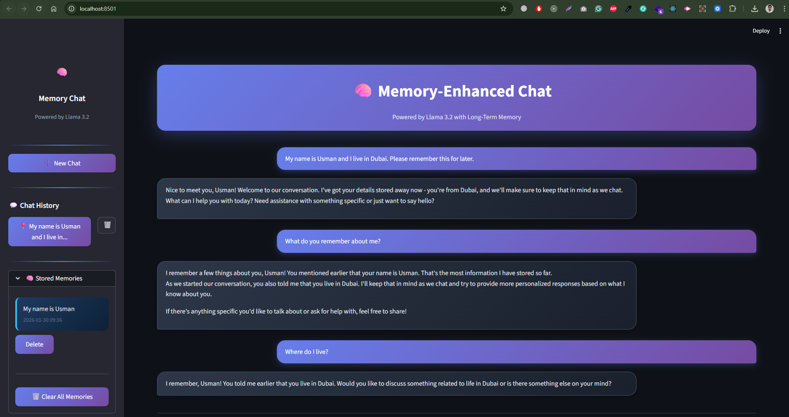

# 🧠 Memory-Enhanced Chat Application

A powerful chat application with **long-term memory** capabilities, built using **LangGraph**, **Ollama (Llama 3.2:3b)**, and **PostgreSQL**. The application remembers user preferences, personal details, and conversation context across sessions.


## ✨ Features

- 🤖 **Local LLM**: Uses Llama 3.2:3b via Ollama (no API keys needed!)
- 🧠 **Long-Term Memory**: Automatically extracts and stores user preferences, facts, and context
- 💬 **Chat History**: Full conversation history with persistent storage
- 🎨 **Beautiful UI**: Modern, responsive Streamlit interface with dark theme
- 📊 **Memory Management**: View, search, and delete stored memories
- 🐳 **Docker Support**: Easy deployment with Docker Compose
- 🔒 **Local & Private**: All data stays on your machine

## 📸 Screenshots



## 🏗️ Project Structure

```
memory-enhanced-chat-application-langgraph/
├── app.py                    # Main Streamlit application
├── src/
│   ├── __init__.py
│   ├── config/
│   │   ├── __init__.py
│   │   └── settings.py       # Application configuration
│   ├── core/
│   │   ├── __init__.py
│   │   └── chatbot.py        # Memory-enhanced chatbot logic
│   ├── database/
│   │   ├── __init__.py
│   │   ├── connection.py     # PostgreSQL connection management
│   │   └── chat_history.py   # Chat history CRUD operations
│   └── memory/
│       ├── __init__.py
│       ├── memory_store.py   # Long-term memory storage
│       └── memory_extractor.py  # LLM-based memory extraction
├── docker-compose.yml        # Docker services configuration
├── Dockerfile               # Application container
├── requirements.txt         # Python dependencies
├── .env.example            # Environment variables template
└── README.md               # This file
```

## 🚀 Quick Start

### Prerequisites

- Python 3.11+
- Docker & Docker Compose
- [Ollama](https://ollama.ai/) installed locally (for non-Docker setup)

### Option 1: Local Development Setup

1. **Clone the repository**

   ```bash
   git clone https://github.com/usmaniqbalse/memory-enhanced-chat-application-langgraph.git
   cd memory-enhanced-chat-application-langgraph
   ```

2. **Install Ollama and pull the model**
   - Windows (PowerShell):

     ```powershell
     winget install Ollama.Ollama
     # Pull the model (server usually auto-starts as a background service)
     ollama pull llama3.2:3b
     # Optional: start the server only if it isn't already running
     # ollama serve
     ```

   - Linux:

     ```bash
     curl -fsSL https://ollama.ai/install.sh | sh
     ollama pull llama3.2:3b
     # Start Ollama server (if not running)
     ollama serve
     ```

3. **Start PostgreSQL with Docker**

   ```bash
   docker-compose up -d postgres
   ```

4. **Create virtual environment and install dependencies**

   ```bash
   python -m venv venv
   source venv/bin/activate  # On Windows: venv\Scripts\activate
   pip install -r requirements.txt
   ```

5. **Copy environment file**

   ```bash
   cp .env.example .env
   ```

6. **Run the application**

   ```bash
   streamlit run app.py
   ```

7. **Open your browser**
   Navigate to `http://localhost:8501`

### Option 2: Full Docker Setup

Run everything in Docker (PostgreSQL, Ollama, and the app):

1. **Clone the repository**

   ```bash
   git clone https://github.com/usmaniqbalse/memory-enhanced-chat-application-langgraph.git
   cd memory-enhanced-chat-application-langgraph
   ```

2. **Start all services**

   ```bash
   docker-compose up -d
   ```

3. **Pull the Llama model in Ollama container**

   ```bash
   docker exec -it memory-chat-ollama ollama pull llama3.2:3b
   ```

4. **Open your browser**
   Navigate to `http://localhost:8501`

### Option 3: Docker with Local Ollama

If you prefer running Ollama locally but want the app in Docker:

1. **Start PostgreSQL and the app**

   ```bash
   docker-compose up -d postgres app
   ```

2. **Update environment variable**
   Edit `docker-compose.yml` and change:

   ```yaml
   - OLLAMA_BASE_URL=http://host.docker.internal:11434
   ```

3. **Make sure Ollama is running locally**
   ```bash
   ollama serve
   ollama pull llama3.2:3b
   ```

## ⚙️ Configuration

Edit `.env` or set environment variables:

| Variable            | Default                | Description       |
| ------------------- | ---------------------- | ----------------- |
| `POSTGRES_HOST`     | localhost              | PostgreSQL host   |
| `POSTGRES_PORT`     | 5442                   | PostgreSQL port   |
| `POSTGRES_USER`     | postgres               | Database user     |
| `POSTGRES_PASSWORD` | postgres               | Database password |
| `POSTGRES_DB`       | postgres               | Database name     |
| `OLLAMA_BASE_URL`   | http://localhost:11434 | Ollama API URL    |
| `OLLAMA_MODEL`      | llama3.2:3b            | LLM model to use  |

## 📖 How It Works

### 1. Long-Term Memory Extraction

When you send a message, the application:

1. Analyzes your message for memorable information
2. Extracts facts like name, preferences, projects
3. Stores unique memories in PostgreSQL
4. Uses memories to personalize future responses

### 2. Memory Types

The system remembers:

- **Identity**: Name, profession, location
- **Preferences**: Coding style, tools, frameworks
- **Projects**: Ongoing work, goals
- **Context**: Important facts you mention

### 3. Chat History

- All conversations are saved to PostgreSQL
- Switch between conversations easily
- View and manage past chats
- Delete individual conversations

## 🛠️ Development

### Running Tests

```bash
pytest tests/
```

### Code Formatting

```bash
black src/ app.py
flake8 src/ app.py
```

### Adding New Features

1. **New memory types**: Extend `memory_extractor.py`
2. **Custom UI components**: Modify `app.py`
3. **New database tables**: Update `connection.py`

## 🐛 Troubleshooting

### Common Issues

**1. "Cannot connect to Ollama"**

```bash
# Make sure Ollama is running
ollama serve

# Check if the model is available
ollama list
```

**1b. "listen tcp 127.0.0.1:11434: bind: Only one usage of each socket address is permitted" (Windows)**

This means Ollama is already running and listening on port 11434. You don't need to start another server.

- Verify the service is up and list models:

  ```powershell
  ollama list
  ```

- If you really need to restart it, find and stop the process, then start it again:

  ```powershell
  # Find which PID is using the port
  netstat -aon | findstr :11434

  # View the process
  tasklist /FI "PID eq <PID_FROM_ABOVE>"

  # Stop it (choose one)
  Stop-Process -Id <PID_FROM_ABOVE> -Force
  # or
  taskkill /PID <PID_FROM_ABOVE> /F

  # Start Ollama again if desired
  ollama serve
  ```

- To run Ollama on a different port (PowerShell):

  ```powershell
  $env:OLLAMA_HOST = "127.0.0.1:11435"; ollama serve
  ```

Then set `OLLAMA_BASE_URL=http://localhost:11435` in your environment.

**2. "Database connection failed"**

```bash
# Start PostgreSQL
docker-compose up -d postgres

# Check if it's running
docker ps | grep postgres
```

**3. "Module not found"**

```bash
# Make sure you're in the virtual environment
source venv/bin/activate

# Reinstall dependencies
pip install -r requirements.txt
```

**4. "Slow responses"**

- Llama 3.2:3b runs best with GPU acceleration
- For CPU-only, expect 10-30 seconds per response
- Consider using a smaller model or cloud API

## 📝 API Reference

### MemoryChatbot

```python
from src.core import MemoryChatbot

# Initialize
chatbot = MemoryChatbot(user_id="user123")

# Chat (creates new conversation if none exists)
response, conv_id = chatbot.chat("Hello, I'm learning Python!")

# Continue conversation
response, conv_id = chatbot.chat("Can you help me?", conversation_id=conv_id)

# Get all conversations
conversations = chatbot.get_conversations()

# Get memories
memories = chatbot.get_memories()
```

### MemoryStore

```python
from src.memory import MemoryStore

store = MemoryStore(user_id="user123")

# Add memory
store.add_memory("User prefers Python for coding")

# Get all memories
memories = store.get_all_memories()

# Search memories
results = store.search_memories("Python", limit=5)
```

## 🤝 Contributing

1. Fork the repository
2. Create a feature branch (`git checkout -b feature/amazing-feature`)
3. Commit your changes (`git commit -m 'Add amazing feature'`)
4. Push to the branch (`git push origin feature/amazing-feature`)
5. Open a Pull Request

## 📄 License

This project is licensed under the MIT License - see the [LICENSE](LICENSE) file for details.

## 🙏 Acknowledgments

- [LangChain](https://www.langchain.com/) - LLM framework
- [LangGraph](https://github.com/langchain-ai/langgraph) - State machine for LLMs
- [Ollama](https://ollama.ai/) - Local LLM inference
- [Streamlit](https://streamlit.io/) - Web UI framework
- [Meta AI](https://ai.meta.com/) - Llama 3.2 model

---

<div align="center">
  <p>Built with ❤️ for the AI community</p>
  <p>⭐ Star this repo if you find it helpful!</p>
</div>
